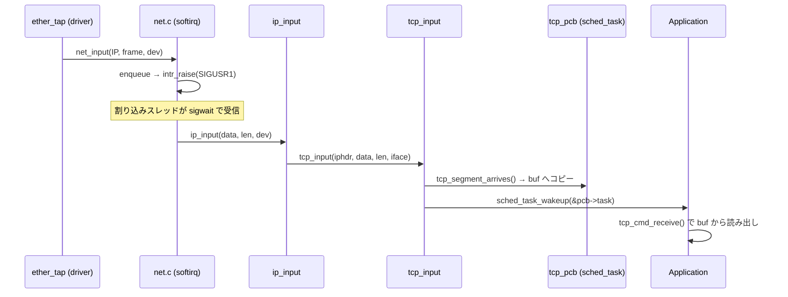
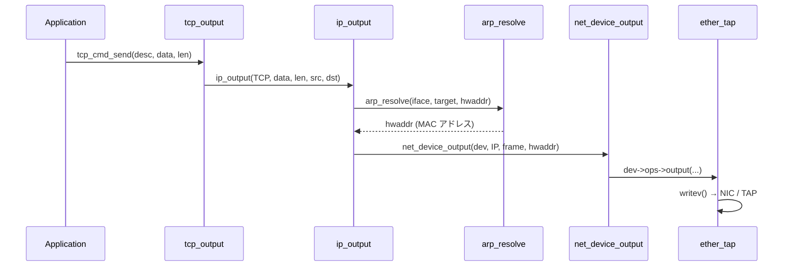
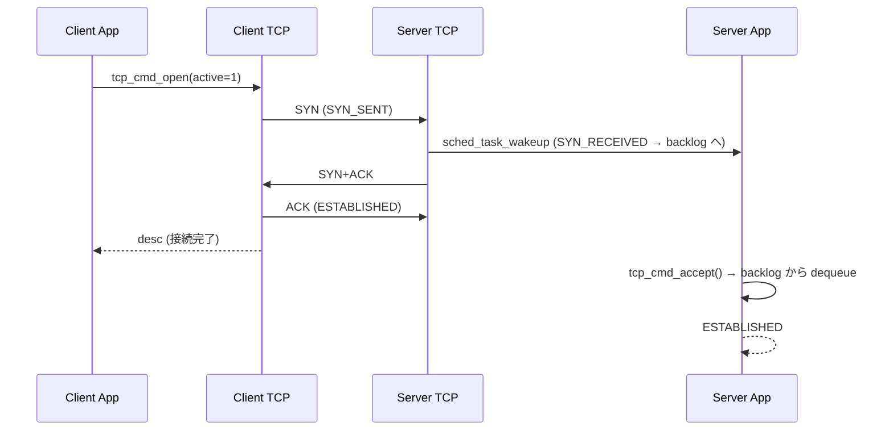
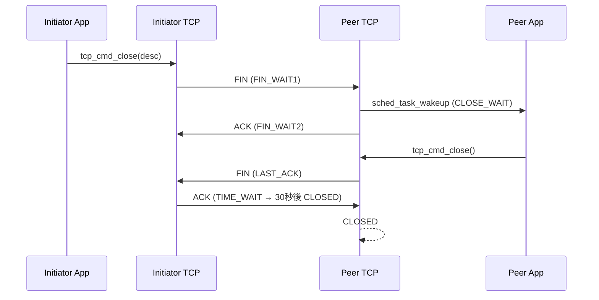
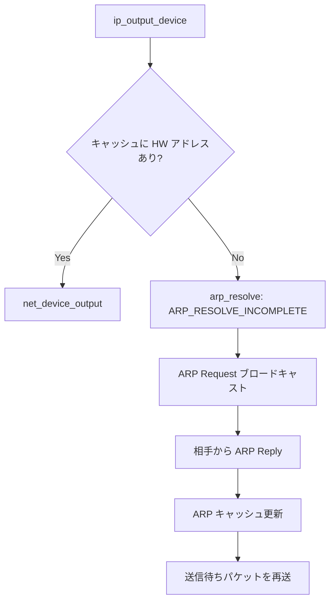

# データフロー図（逆生成）

## パケット受信フロー

```
[NIC / TAP デバイス]
        │  (ether_tap: read syscall or loopback)
        ▼
[ether_input()]              ←── ether.c
  フレーム検証・パース
        │  net_input(type, data, len, dev)
        ▼
[net_input()]                ←── net.c
  プロトコルキューに enqueue
  intr_raise(INTR_IRQ_SOFT)  ──→ SIGUSR1 シグナルで割り込みスレッドへ
        │
        ▼  (割り込みスレッドが sigwait で受信)
[net_softirq_handler()]      ←── net.c
  プロトコルキューから dequeue
  proto->handler() を呼び出し
        │
   ┌────┴────┐
   ▼         ▼
[ip_input()]  [arp_input()]   ←── ip.c / arp.c
  IP ヘッダ検証・ルーティング
        │
   ┌────┴────────┐
   ▼             ▼
[tcp_input()]  [udp_input()]  ←── tcp.c / udp.c
  チェックサム検証
  PCB を探索して tcp_segment_arrives() / udp_pcb 受信キューへ
        │
        ▼
  sched_task_wakeup() でアプリスレッドを起こす
        │
        ▼
[tcp_cmd_receive() / udp_cmd_recvfrom()]  ← アプリケーションスレッド
```

### シーケンス図（受信）



---

## パケット送信フロー

```
[Application]
        │  tcp_cmd_send() / udp_cmd_sendto()
        ▼
[tcp_output() / udp_output()]      ←── tcp.c / udp.c
  擬似ヘッダチェックサム計算
  ip_output(protocol, data, len, src, dst) を呼び出し
        │
        ▼
[ip_output()]                       ←── ip.c
  ルーティングテーブル検索 ip_route_lookup(dst)
  IP ヘッダ構築・チェックサム計算
  arp_resolve() で宛先 MAC アドレス解決
  net_device_output() を呼び出し
        │
        ▼
[net_device_output()]               ←── net.c
  dev->ops->output(dev, type, data, len, hwaddr)
        │
        ▼
[ether_tap / loopback driver]       ←── platform/linux/driver/ether_tap.c
  Ethernet フレームを writev / write で送出
```

### シーケンス図（送信）



---

## TCP 接続確立フロー（3-way handshake）



---

## TCP 接続切断フロー（4-way handshake）



---

## 割り込み・スレッドモデル

```
Main Thread (Application)          Interrupt Thread
      │                                   │
      │  net_run()                         │  intr_run() → pthread_create
      │  ──────────────────────────────>  │  sigwait(&sigmask, &sig)
      │                                   │
      │  tcp_cmd_send()                   │
      │  → ip_output()                    │
      │  → intr_raise(SIGUSR1) ──────>   │  sig == SIGUSR1
      │                                   │  → net_softirq_handler()
      │                                   │    → ip_input()
      │                                   │    → tcp_input()
      │                                   │    → sched_task_wakeup()
      │  <── (条件変数シグナル) ──────    │
      │  tcp_cmd_receive() 復帰           │
      │                                   │  sig == SIGALRM (100ms)
      │                                   │  → tcp_timer() 再送チェック
```

---

## ARP 解決フロー


